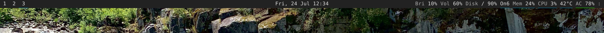

# polybar-simple-default

This is a text-based [polybar](https://github.com/polybar/polybar) default configuration that works out-of-the-box. The original example bar that comes with polybar requires that you download some extra fonts and glyphs, lest they look messy and unusable. While that exibits what polybar is capable of, people like me I think, don't need nothing more than some text. That's what this is.

Here's what it looks like, on my PC:


## Installation

Clone the repo and copy all files to your polybar configuration directory.
``` bash
$ git clone https://github.com/flakyhermit/polybar-simple-default
$ cp polybar-simple-default/* ~/.config/polybar/
```

